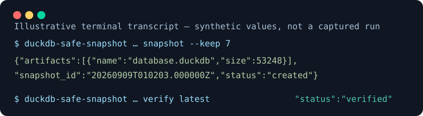

# duckdb-safe-snapshot

Create private, checksummed snapshot sets of a DuckDB database and its WAL while
cooperating writers share one external file lock. It is a small Linux library
and CLI for applications that own their own scheduling and recovery process.



```bash
python -m pip install duckdb-safe-snapshot==0.1.0
```

Every path and owner policy is explicit; the package has no application,
account, service, or production-path defaults.

```bash
duckdb-safe-snapshot \
  --database /var/lib/example/app.duckdb \
  --wal /var/lib/example/app.duckdb.wal \
  --lock /run/example/writer.lock \
  --backup-root /var/backups/example/snapshots \
  --state-root /var/lib/example/snapshot-state \
  --source-owner-uid 1001 \
  --lock-owner-uid 1001 \
  --snapshot-owner-uid 1002 \
  --database-artifact database.duckdb \
  --wal-artifact app.duckdb.wal \
  --metadata-json '{"application":"example"}' \
  --release release-42 \
  snapshot --keep 7

duckdb-safe-snapshot \
  --database /var/lib/example/app.duckdb --wal /var/lib/example/app.duckdb.wal \
  --lock /run/example/writer.lock \
  --backup-root /var/backups/example/snapshots \
  --state-root /var/lib/example/snapshot-state \
  --source-owner-uid 1001 --lock-owner-uid 1001 --snapshot-owner-uid 1002 \
  --database-artifact database.duckdb --wal-artifact app.duckdb.wal \
  verify latest
```

The JSON response includes the timestamped snapshot id, artifact SHA-256 values,
and pruned recognized snapshots. Copy the database artifact and, when present,
the WAL artifact to the same recovery location before opening the recovery copy.

## Safety model

This package does not make an uncoordinated DuckDB writer safe. Every writer
that can modify the database or WAL must acquire the exact same Linux `flock`
lock before changing either file. The snapshot takes that exclusive lock, checks
source identity before and after copying, and fails if it observes a change.

Completed snapshot directories are created privately (`0700`) and contain only
the configured database artifact, optional WAL, a canonical JSON manifest, and
its SHA-256 checksum (`0600`). A temporary directory becomes visible as a
completed set only through `rename`; the set is then verified before `latest`
is atomically updated. Verification rejects symlinks, hardlinked files,
unexpected ownership or modes, missing/extra entries, malformed manifests, and
checksum or size mismatches. Retention deletes only recognized, already-verified
timestamped sets.

`Config` resolves existing path aliases and rejects relative paths, output-root
aliases, output-root nesting, and
database/lock paths inside private output roots. It also requires all three
owner UIDs and simple, distinct database/WAL artifact names. The caller must
create the shared lock under an ownership/mode policy accepted by `Config`.

This is intentionally not a restore tool, service manager, or scheduler. Its
file checks protect leaf files and configured private roots; callers must also
keep each parent directory trusted against replacement. Use a
disposable recovery copy to test your own restoration procedure. The package
uses POSIX `fcntl.flock`, `O_NOFOLLOW`, directory fsync, and POSIX permissions;
it is supported on Linux filesystems with those semantics. Network filesystems
and writers that do not honor the shared lock are outside its consistency claim.

## Python API

```python
from pathlib import Path
from duckdb_safe_snapshot import Config, create_snapshot, verify_latest

config = Config(
    database_path=Path("/var/lib/example/app.duckdb"),
    wal_path=Path("/var/lib/example/app.duckdb.wal"),
    lock_path=Path("/run/example/writer.lock"),
    backup_root=Path("/var/backups/example/snapshots"),
    state_root=Path("/var/lib/example/snapshot-state"),
    source_owner_uid=1001,
    lock_owner_uid=1001,
    snapshot_owner_uid=1002,
    database_artifact_name="database.duckdb",
    wal_artifact_name="app.duckdb.wal",
    metadata={"application": "example"},
    release=lambda: "release-42",  # optional caller-owned identifier
)

created = create_snapshot(config, keep=7)
assert verify_latest(config)["snapshot_id"] == created["snapshot_id"]
```

## Compatibility and maintenance

The source requires Python 3.10–3.12. CI tests those Python versions with
DuckDB 1.5.5, the version used to produce the initial real database/WAL recovery
test. DuckDB is not a runtime dependency because this package copies files; it
is a test dependency only. No compatibility promise is made for other DuckDB,
Python, operating-system, or filesystem versions until they are tested.

An application can pass `release` as a string or no-argument callback. The
resulting optional string is recorded as the manifest's top-level `release`
field while the writer lock is held. Release meaning and validation stay with
the application; existing schema-1 manifests without that optional field remain
verifiable.

This project was extracted from a private application maintained by
[Sid Kalla](https://github.com/sidko). The public package contains synthetic
tests and generic configuration only. It is Apache-2.0 licensed; that license
does not grant rights to Gale Finance names, logos, or visual identity. Support
is best effort from the current release.

See [CONTRIBUTING.md](CONTRIBUTING.md), [SECURITY.md](SECURITY.md), and
[AGENT_INTEGRATION.md](AGENT_INTEGRATION.md).

Early commits reconstruct milestones developed in the private Gale Finance
monorepo. Author dates reflect the original work; public content and hashes were
rewritten to exclude private details. Some early development used Claude as a
coding assistant; Sid Kalla selected, reviewed and maintains this code.
